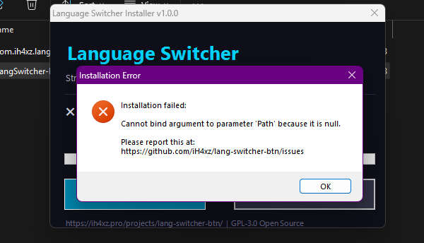
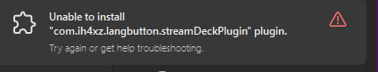

# Language Switcher for Stream Deck

<p align="center">
  
  
</p>

> 🌐 Display and switch your keyboard input language (EN/AR) with a single Stream Deck button press.

Cute dark-mode icons with bright glowing indicators. Made for Windows 11.

## Features

- **Live Language Display** — Shows the current keyboard language (EN or ع) on the button in real-time
- **One-Tap Toggle** — Press the button to switch between English and Arabic
- **Beautiful Dark UI** — Glassmorphic design with cyan (EN) and pink (AR) glow effects
- **Zero Dependencies** — No native modules to compile, uses PowerShell for Windows API access
- **Lightweight** — Polls every 1.5 seconds with minimal CPU usage

## Requirements

- **Stream Deck Software** 6.6 or later
- **Windows 10/11**
- **Node.js 20** (bundled by Stream Deck SDK)

## Installation

### From Release

1. Download the latest `.streamDeckPlugin` file from [Releases](https://github.com/iH4xz/lang-switcher-btn/releases)
2. Double-click the file to install it in Stream Deck

### Manual Install

1. Clone this repository:
   ```bash
   git clone https://github.com/iH4xz/lang-switcher-btn.git
   ```
2. Install dependencies and build:
   ```bash
   npm install
   npm run build
   ```
3. Copy the `com.ih4xz.langbutton.sdPlugin` folder to:
   ```
   %APPDATA%\Elgato\StreamDeck\Plugins\
   ```
4. Restart the Stream Deck software

## Development

```bash
# Install dependencies
npm install

# Build once
npm run build

# Watch mode (auto-rebuild + hot-reload)
npm run watch
```

## How It Works

1. **Detection**: Uses PowerShell P/Invoke to call Win32 `GetKeyboardLayout()` API on the foreground window's thread
2. **Rendering**: Dynamically generates SVG button images with glow effects and pushes them via `setImage()`
3. **Switching**: Simulates `Alt+Shift` keypress via `keybd_event()` to toggle the Windows input language

## Configuration

The plugin uses `Alt+Shift` to toggle languages. If you use a different shortcut (e.g., `Win+Space`), edit `scripts/switch-language.ps1`.

## Author

**iH4xz** — [ih4xz.pro](https://ih4xz.pro)

- Project Page: [ih4xz.pro/projects/lang-switcher-btn](https://ih4xz.pro/projects/lang-switcher-btn/)
- GitHub: [github.com/iH4xz/lang-switcher-btn](https://github.com/iH4xz/lang-switcher-btn)

## License

This project is licensed under the [GNU General Public License v3.0](LICENSE) — see the LICENSE file for details.
