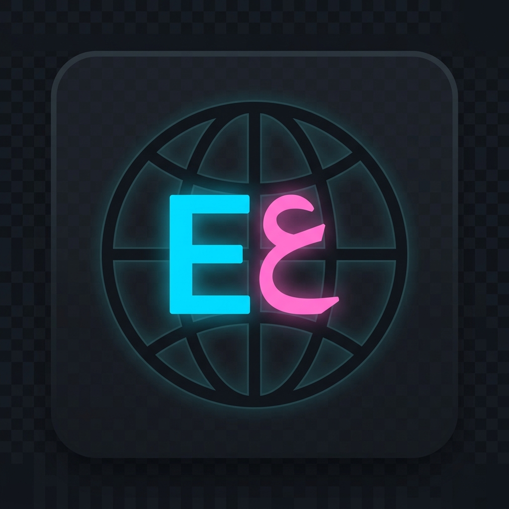
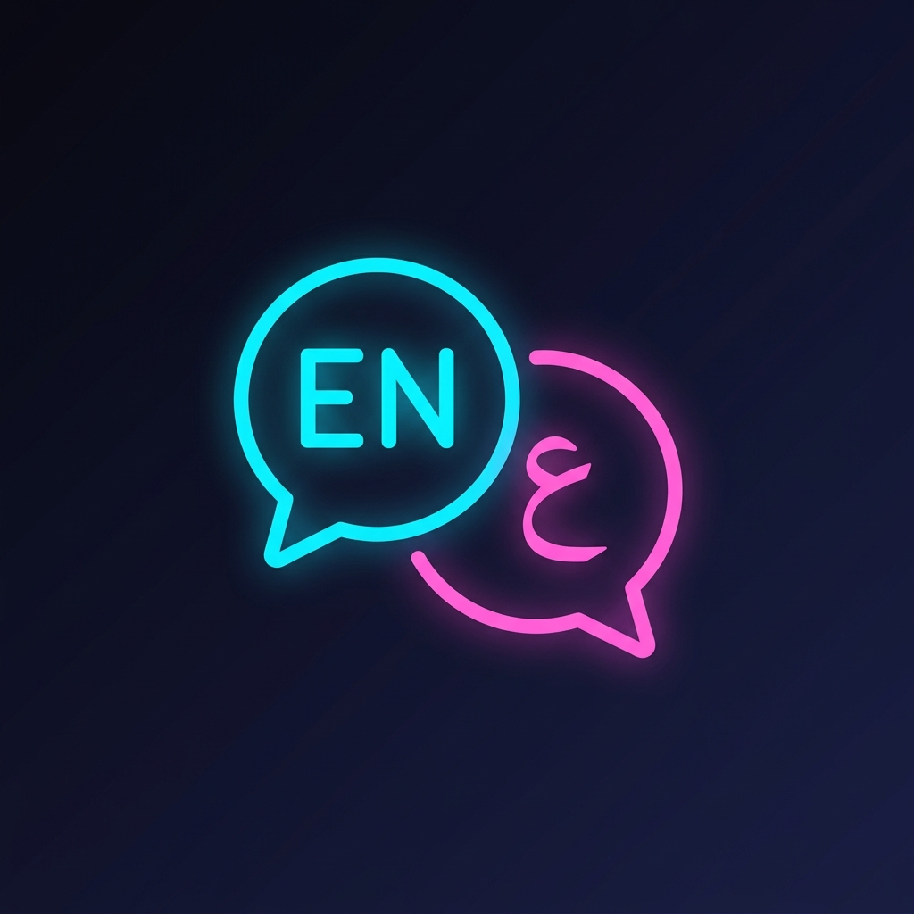

# مُبدِّل اللغة لـ Stream Deck (Language Switcher)

<p align="center">
  
  
</p>

> 🌐 اعرض وبدّل لغة إدخال لوحة المفاتيح الحالية (EN/AR) بضغطة زر واحدة على Stream Deck.

أزرار رائعة المظهر في الوضع الداكن مع مؤشرات مضيئة ساطعة. مصمم خصيصاً لويندوز 10/11.

## المميزات

- **عرض فوري ومباشر للغة** — يعرض لغة لوحة المفاتيح الحالية (EN أو ع) على الزر في الوقت الفعلي.
- **تبديل بضغطة واحدة** — اضغط على الزر للتبديل بين اللغتين العربية والإنجليزية.
- **تصميم داكن جذاب** — تأثير توهج باللون السماوي (EN) والوردي (AR) مع خلفية متدرجة أنيقة.
- **بدون تبعيات ثقيلة** — لا حاجة لبناء مكتبات فجّة؛ يستخدم سكربت PowerShell للوصول الفوري لـ Win32 API.
- **خفيف جداً** — يتحقق من اللغة كل 1.5 ثانية باستهلاك يكاد ينعدم للمعالج.

## المتطلبات

- برنامج **Stream Deck Software** 6.6 أو أحدث.
- نظام تشغيل **ويندوز 10 أو 11**.
- مدمج تلقائياً مع Stream Deck SDK.

## التثبيت

### الخيار الأسهل (التثبيت بنقرة واحدة)

1. حمّل أحدث ملف `com.ih4xz.langbutton.streamDeckPlugin` من [صفحة الإصدارات (Releases)](https://github.com/iH4xz/lang-switcher-btn/releases).
2. **انقر نقراً مزدوجاً** على الملف المحمّل لتثبيته مباشرة داخل تطبيق Stream Deck.

### التثبيت اليدوي

1. استنسخ هذا المستودع:
   ```bash
   git clone https://github.com/iH4xz/lang-switcher-btn.git
   ```
2. ثبّت التبعيات وابني الإضافة:
   ```bash
   npm install
   npm run build
   ```
3. انسخ المجلد `com.ih4xz.langbutton.sdPlugin` إلى مسار إضافات Stream Deck:
   ```
   %APPDATA%\Elgato\StreamDeck\Plugins\
   ```
4. أعد تشغيل برنامج Stream Deck.

## التطوير

```bash
# تثبيت التبعيات
npm install

# بناء المشروع لمرة واحدة
npm run build

# وضع المراقبة (بناء تلقائي + تحديث فوري في Stream Deck)
npm run watch
```

## كيف يعمل

1. **الكشف**: يستخدم PowerShell P/Invoke لاستدعاء Win32 API `GetKeyboardLayout()` على سلسلة الرسائل الخاصة بالنافذة الأمامية النشطة.
2. **الرسم**: ينشئ ديناميكياً صور أزرار بصيغة SVG مع تأثيرات توهج جذابة ويرسلها عبر `setImage()`.
3. **التبديل**: يحاكي ضغط المفاتيح `Alt+Shift` عبر `keybd_event()` لتبديل لغة الإدخال في نظام ويندوز.

## الإعدادات

تستخدم هذه الإضافة اختصار `Alt+Shift` لتبديل اللغات. إذا كنت تستخدم اختصاراً مختلفاً (على سبيل المثال، `Win+Space`)، قم بتعديل الملف `scripts/switch-language.ps1`.

## المطوّر

**iH4xz** — [ih4xz.pro](https://ih4xz.pro)

- صفحة المشروع: [ih4xz.pro/projects/lang-switcher-btn](https://ih4xz.pro/projects/lang-switcher-btn/)
- جيت هاب: [github.com/iH4xz/lang-switcher-btn](https://github.com/iH4xz/lang-switcher-btn)

## الترخيص

هذا المشروع مرخص بموجب رخصة [GNU General Public License v3.0](LICENSE) — راجع ملف LICENSE لمعرفة التفاصيل.

---

# Language Switcher for Stream Deck

> 🌐 Display and switch your keyboard input language (EN/AR) with a single Stream Deck button press.

Cute dark-mode icons with bright glowing indicators. Made for Windows 10/11.

## Features

- **Live Language Display** — Shows the current keyboard language (EN or ع) on the button in real-time
- **One-Tap Toggle** — Press the button to switch between English and Arabic
- **Beautiful Dark UI** — Glassmorphic design with cyan (EN) and pink (AR) glow effects
- **Zero Dependencies** — No native modules to compile, uses PowerShell for Windows API access
- **Lightweight** — Polls every 1.5 seconds with minimal CPU usage

## Requirements

- **Stream Deck Software** 6.6 or later
- **Windows 10/11**
- **Node.js 20** (bundled by Stream Deck SDK)

## Installation

### Easy Install (One-Click)

1. Download the latest `.streamDeckPlugin` file from [Releases](https://github.com/iH4xz/lang-switcher-btn/releases)
2. Double-click the downloaded file to install it in Stream Deck

### Manual Install

1. Clone this repository:
   ```bash
   git clone https://github.com/iH4xz/lang-switcher-btn.git
   ```
2. Install dependencies and build:
   ```bash
   npm install
   npm run build
   ```
3. Copy the `com.ih4xz.langbutton.sdPlugin` folder to:
   ```
   %APPDATA%\Elgato\StreamDeck\Plugins\
   ```
4. Restart the Stream Deck software

## Development

```bash
# Install dependencies
npm install

# Build once
npm run build

# Watch mode (auto-rebuild + hot-reload)
npm run watch
```

## How It Works

1. **Detection**: Uses PowerShell P/Invoke to call Win32 `GetKeyboardLayout()` API on the foreground window's thread.
2. **Rendering**: Dynamically generates SVG button images with glow effects and pushes them via `setImage()`.
3. **Switching**: Simulates `Alt+Shift` keypress via `keybd_event()` to toggle the Windows input language.

## Configuration

The plugin uses `Alt+Shift` to toggle languages. If you use a different shortcut (e.g., `Win+Space`), edit `scripts/switch-language.ps1`.

## Author

**iH4xz** — [ih4xz.pro](https://ih4xz.pro)

- Project Page: [ih4xz.pro/projects/lang-switcher-btn](https://ih4xz.pro/projects/lang-switcher-btn/)
- GitHub: [github.com/iH4xz/lang-switcher-btn](https://github.com/iH4xz/lang-switcher-btn)

## License

This project is licensed under the [GNU General Public License v3.0](LICENSE) — see the LICENSE file for details.
